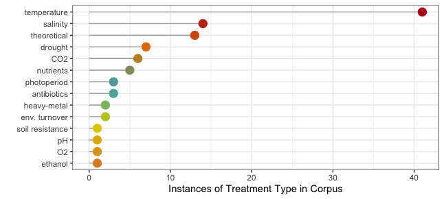
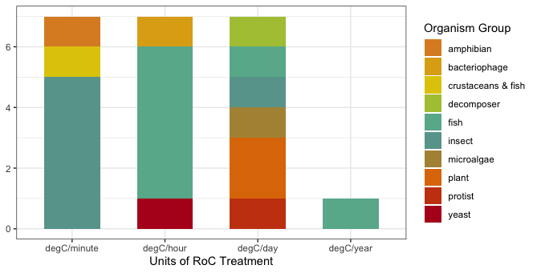

```{r setup, include=FALSE}
knitr::opts_chunk$set(echo = TRUE)
```

## Überblick

Diese Aktivität ist eine Einführung in einige Methoden und R-Packages, die verwendet werden können, um eine "Systematic Review" der Literatur durchzuführen. Wir werden diese Methoden benutzen, um die Literatur über **Bodenkohlenstoff** zu untersuchen. Wir werden das von Nakagawa *et al.* (2019) vorgeschlagene "research weaving"-Framework verwenden, das Bibliometrie und systematisches Mapping beinhaltet. Aus ihrem Abstract (Hervorhebung von mir):

> "Research weaving provides a novel framework that **combines bibliometrics and systematic mapping** to inform the development of a field, the influence of research papers and their interconnections, and to visualize content across and within publications."

> "Research weaving has the potential to provide a more efficient, in-depth, and broad synthesis of a research field, to identify **research biases, gaps, and limitations**. Such insights have the potential to inform ecological and environmental **policy** and **communicate research findings to the general public** in more effective ways then are typically done in current research syntheses."

Ihr könnt mehr über das "Research Weaving" erfahren, indem ihr ihre Artikel [hier](https://doi.org/10.1016/j.tree.2018.11.007) lest.

Ihr werdet damit beginnen, eine Forschungsfrage zu entwickeln und dann mit Web of Science [WoS](https://apps.webofknowledge.com/WOS_GeneralSearch_input.do?product=WOS&search_mode=GeneralSearch&SID=D5U7NnnEhob17JVozzU&preferencesSaved=) eine Literaturrecherche durchzuführen. Ihr müsst ein VPN eingerichtet haben, um WoS von zu Hause aus nutzen zu können - wenn ihr das noch nicht getan habt, folgt den Anweisungen der FU-Bibliothek [hier](https://www.zedat.fu-berlin.de/VPN).

Denke daran, dass eure Gruppe eure Forschungsfrage und den 'Search string' genehmigt bekommen haben muss, bevor ihr fortfahrt! 

Ihr werdet dann die Suchergebnisse als .bib-Datei exportieren. Diese wird verwendet, um eine explorative bibliometrische Analyse mit dem Paket `bibliometrix` durchzuführen (vielleicht erinnert ihr euch daran, wenn ihr das Ökologie Basismodul im Juni belegt habt).

Ihr werdet dann Einschluss-/Ausschlusskriterien entwickeln und die Package `revtools` benutzen, um die Literatur zu screenen.

## Entwickeln einer Forschungsfrage und eines Search string

### 1. Finde ein Thema mit eurer Gruppe

Eure erste Aufgabe ist es, eine Literaturrecherche im Web of Science (WoS) zum Thema **Kohlenstoffkreislauf, organische Bodensubstanz und/oder Zersetzung in Böden** durchzuführen. Ihr möchtet z.B. Literatur über Nekromasse erforschen, die Kohlenstoffdynamik in Wüstenböden untersuchen oder untersuchen, wie Trockenheit den Abbau organischer Substanz im Boden beeinflusst. Bitte besprecht das Thema in der Gruppe und findet ein Thema, das für euch alle interessant ist.

### 2. Entwickelt eine Forschungsfrage

Dann solltet ihr euch eine Forschungsfrage überlegen. Diese sollte so allgemein sein, dass sie durch eine Literaturrecherche beantwortet werden kann. Zum Beispiel: "Wie beeinflusst Trockenheit die Zersetzung organischer Substanz im Boden?" oder "Wie tragen Pilze zur Nekromassendynamik im Boden bei?".

### 3. Beginnt die Suche...und entwickelt einen Search string

Ihr werdet euren eigenen Search string erstellen müssen, mit Ergebnissen im Bereich von 100-300 Artikeln. Euer Ziel ist es, einen Search string zu erstellen, der *alle* Artikel erfasst, die für dein Forschungsthema relevant sind. 

Hier sind einige Beispiele für Search strings:

> ("soil organic matter"  OR "soil organic carbon"  OR "organic matter")  AND (decomposition  OR degradation)  AND drought

dieser Suchstring verwendet Anführungszeichen "", um sicherzustellen, dass nur Artikel mit dem gesamten Ausdruck "soil organic matter" in den Ergebnissen erscheinen. Er verwendet auch mehrere Wörter, z.B. "decomposition" und "degradation", um die gleiche Sache zu beschreiben. Dies erhöht die Chancen, alle relevanten Artikel zu finden.

> (soil  AND necromass AND fung*)

dieser Search string verwendet ein Sternchen *, so dass alle Ergebnisse, die mit 'fung' beginnen, angezeigt werden (z.B. fungi, fungus, fungicide).

Ihr könnt über die Operatoren (z.B. AND und OR) lesen, die ihr in eurem Search string verwenden müsst [hier](https://images.webofknowledge.com/images/help/WOS/hs_search_operators.html) und es gibt weitere [WoS-Suchtipps hier](https://clarivate.libguides.com/woscc/searchtips).

### 4. Verfeinert die Suche und den Search string

Es gibt *eine Menge* Literatur über Bodenkohlenstoff - stellt sicher, dass ihr eure Suche verfeinert, um etwa 100-300 Ergebnisse zu erhalten. Ihr solltet alle zuerst versuchen, die Anzahl der Ergebnisse zu reduzieren, indem ihr eure Forschungsfrage spezifischer macht. Konzentriert euch zum Beispiel auf eine bestimmten Art von Ökosystem (tropischer Wald oder Grasland). Falls nötig, könnt ihr die Anzahl der Suchergebnisse weiter reduzieren, indem ihr die 'Refine Results'-Kategorien auf WoS nutzt. Ihr könntet zum Beispiel die Jahre der Suche eingrenzen oder Review-Artikel ausschließen. Schreibt auf, was ihr tut! Und denkt daran, diese Entscheidungen werden später beeinflussen, wie ihr eure Ergebnisse interpretiert!

**Wenn ihr euch für ein Thema entschieden habt, muss es von mir genehmigt werden, bevor eure Gruppe weitermacht.**

## Bibliometrics Analyse

Sobald euer Thema genehmigt ist, könnt ihr mit der bibliometrischen Analyse beginnen. 

### 1. Erstelle eine BibTeX-Datei im Web of Science

Ich habe ein Tutorial-Video aufgenommen, das zeigt, wie man eine Literatursuche im Web of Science durchführt und die Ergebnisse als .bib-Datei exportiert. Dieses ist auf [VBrick](https://fu-berlin.eu.vbrickrev.com/sharevideo/2cb4b6bb-11a1-4b38-8618-705412d5fde3) verfügbar. Folgt dem Video und erstelle eure BibTeX-Datei.

### 2. Beginne eure Bibliometrics Analyse

Nun könnt ihr mit der Arbeit in R beginnen. Erstellt ein neues R-Skript für das Projekt. Falls ihr die Package `bibliometrix` noch nicht installiert habt, tut dies bitte jetzt, etwa so: 

```{r eval = FALSE}
install.packages("bibliometrix", dependencies=TRUE)
```

und ladet dann die Package:

```{r message = FALSE}
library(bibliometrix)
```

[Die Dokumentation findet sich hier](https://cran.r-project.org/web/packages/bibliometrix/bibliometrix.pdf).

Sobald ihr eine .bib-Datei erstellt habt, müsst ihr die Daten mit der Package `bibliometrix` in R laden und eine bibliometrische Analyse durchführen. Folgt [diesem Tutorial](https://www.bibliometrix.org/vignettes/Introduction_to_bibliometrix.html). Wir beginnen mit dem Abschnitt [Data loading and converting](https://www.bibliometrix.org/vignettes/Introduction_to_bibliometrix.html#data-loading-and-converting). Es kann sein, dass ihr ein paar Minuten warten müsst, bis der bibliografische Data Frame generiert wird... achtet auf die Konsole!

Sobald der Data Frame geladen ist, überprüft ihn. Was sind die Spaltennamen?
Tipp: versucht es mit `colnames()`.
Diese 2-Buchstaben-Codes werden 'field tags' genannt und es gibt eine komplette Liste [hier](https://www.bibliometrix.org/documents/Field_Tags_bibliometrix.pdf). Ihr werdet diese später benutzen müssen.

### 3. Eine deskriptive Analyse durchführen

Folgt dem Tutorial weiter und führe eine deskriptive [Bibliometric analysis](https://www.bibliometrix.org/vignettes/Introduction_to_bibliometrix.html#bibliometric-analysis) durch. Führe die Funktion `summary` aus. Schaut euch die Ergebnisse der Zusammenfassung in der Konsole an. Schreibt die Zeitspanne und die Anzahl der Quellen und Dokumente auf. Was sind die 5 am häufigsten zitierten Artikel in eurer Sammlung? Kopiert die DOIs in Web of Science und schaut euch die Abstracts an (Tipp: einige dieser Artikel könnten gut in der Einleitung eures Protokolls zitiert werden). Führt nun die Funktion `plot` aus. Speichere die Plots, die die "Most Productive Countries" und die "Annual Scientific Production" zeigen.

```{r include = FALSE}
file <- "/Users/fastloris/Dropbox/Vertiefungsmodul course materials/WS2021/Praktikum/VM_bib_deu/soil_necromass_fungi.bib"
M <- convert2df(file = file, dbsource = "isi", format = "bibtex")
results <- biblioAnalysis(M, sep = ";")
S <- summary(object = results, k = 10, pause = FALSE)
```

Ihr könnt schnell den DOI oder das Publikationsjahr (oder jede andere Information im Datenrahmen) anzeigen, indem ihr den Artikel/Zeilennamen und den Field tag angebt, wie hier:

```{r}
M["MILTNER A, 2012, BIOGEOCHEMISTRY", "DI"]
M["MILTNER A, 2012, BIOGEOCHEMISTRY", "PY"]
```

Nun wollen wir herausfinden, wie sich euer Forschungsthema im Laufe der Zeit entwickelt hat. Folgt dem Tutorial-Abschnitt [Top-Authors’ Productivity over the Time](https://www.bibliometrix.org/vignettes/Introduction_to_bibliometrix.html#top-authors-productivity-over-the-time). Speichert diesen Plot (bei einigen Datensätzen funktioniert das nicht gut -- wenn es nicht funktioniert, verzweifelt nicht, verwendet die/den 'produktivste/n AutorIn' Plot von vorher). Wer sind die AutorInnen, die heutzutage am meisten publizieren? Wer waren die AutorInnen, die früher am meisten veröffentlicht haben? Gibt es AutorInnen, die über einen langen Zeitraum regelmäßig publizieren? (Tipp: Ihr solltet euch einige dieser AutorInnen auf Referenzen für euer Protokoll angucken.)

Schauen wir uns nun an, wie die Keywords in den Artikeln miteinander verbunden sind. Dies wird uns einen Einblick geben, wie die Unterthemen innerhalb deines Themas miteinander verbunden sind. Folgt dem Tutorial, um [Keyword co-ccurrences](https://www.bibliometrix.org/vignettes/Introduction_to_bibliometrix.html#keyword-co-occurrences) darzustellen. Gibt es Cluster von Keywords? Welche Ideen sind miteinander verbunden? Was sagt euch das über euer Thema? Zeigt dies etwas über die Art und Weise, wie Gruppen von Menschen über dieses Thema nachdenken/daran forschen?

```{r echo = FALSE}
NetMatrix <- biblioNetwork(M, analysis = "co-occurrences", network = "keywords", sep = ";")
net=networkPlot(NetMatrix, normalize="association", weighted=T, n = 30, Title = "Keyword Co-occurrences", type = "fruchterman", size=T,edgesize = 5,labelsize=0.7)
```

Schließlich werden wir die Beziehungen zwischen AutorInnen, Keywords und WoS-Kategorien untersuchen. Das Beispiel unten zeigt Verbindungen zwischen AutorInnen, Keywords und WoS-Kategorien. Ihr könnt jede beliebigen 3 Field Tags benutzen -- die Betrachtung von Journals (SO) oder Common Cited References (CR) könnte auch interessant sein. Wir werden dies mit einem Three-fields plot machen, mit der Funktion `threeFieldsPlot`. Sucht in der Hilfe-Suchleiste in R, um über diese Funktion zu lesen und ein Beispiel für ihre Verwendung zu sehen. Versucht, auf eines der Keywords oder AutorInnen im Plot unten zu klicken.

```{r echo = FALSE}
threeFieldsPlot(M, fields=c("DE","AU","SC"),n=c(10,10,10),width = 900)
```

Achte darauf, dass ihr alle Ergebnisse und Diagramme aus dieser Aufgabe speichert. Wenn ihr fertig seid, würde ich empfehlen, dass ihr als Gruppe ein paar Sätze über jedes Diagramm schreibt - wie interpretiert ihr die Ergebnisse, die ihr erzeugt habt? Das wird es euch später leichter machen, euer Protokoll zu schreiben.

## Systematic Mapping

Im nächsten Teil dieser Aktivität geht es darum, eure Artikel zu sichten und einige Informationen aus ihnen zu extrahieren, um 'Systematic maps' zu erstellen. 

### 1. Einschluss/Ausschluss-Kriterien

Der erste Schritt besteht darin, eure Einschluss-/Ausschlusskriterien zu erstellen. Mit anderen Worten, was sind die Merkmale der Artikel, die ihr überprüfen wirst?

Ihr solltet eure Forschungsfrage überdenken und entscheiden, welche Art von Artikeln und Daten nützlich sind, um eure Frage zu beantworten. Nehme ich meine Suche nach Boden/Nekromasse/Pilzen als Beispiel, könnte ich daran interessiert sein, wie die Pilzvielfalt und -aktivität die Zersetzung oder Stabilisierung von Nekromasse im Boden beeinflusst. Ich würde also nur Artikel einschließen, die sowohl Nekromasse als auch Pilzlebensgemeinschaften (Diversität oder Funktionen) untersuchen. Ich würde Studien ausschließen, die nur Bakterien und keine Pilze untersuchen, oder die nur die Laubstreu, aber nicht die Nekromasse untersuchen.

Achte darauf, dass ihr eure Ein- und Ausschlusskriterien aufschreibt!! Dies ist sehr wichtig für die Reproduzierbarkeit und muss im Abschnitt 'Methoden' eures Protokolls geschrieben werden.

### 2. Aufteilung der Artikel

Nun zurück zu R, aber nicht für lange! Wir werden `revtools` benutzen, um die Abstracts zu screenen.
Ladet die revtools-Package und eure BibTeX-Datei:

```{r}
library(revtools)
```

```{r eval = FALSE}
recs <- read_bibliography("soil_necromass_fungi.bib")
```

Nun werdet ihr die Artikel mit der Funktion `allocate_effort` auf die Gruppenmitglieder aufteilen. Damit kann man die Anteile der Artikel pro Person bestimmen. Um eine robuste Systematic review zu haben, ist es notwendig, dass einige der Artikel von mehr als einer Person gescreent werden. In diesem Beispiel werden 19% der Artikel von mehr als einer Person gescreent (diese Funktion versucht, so nah wie möglich an den Anteil heranzukommen, den ihr in 'proportion_checked' gewählt habt). Auf diese Weise könnt ihr später sicherstellen, dass jeder die Einschluss-/Ausschlusskriterien auf die gleiche Weise anwendet.

```{r}
alleff <- allocate_effort(reviewers = c("India", "GroupMember1", "GroupMember2"), effort = c(0.33,0.34,0.33), proportion_checked = 0.2, quiet = FALSE)
```

```{r eval = FALSE}
distribute_tasks(recs, alleff)
```

Ein wenig R-Magie ist hinter den Kulissen passiert, als ihr die zweite Code-Zeile ausgeführt habt. Werft einen Blick in euer Arbeitsverzeichnis (oder in den Tab "Dateien" in RStudio). Ihr solltet feststellen, dass es jetzt für jedes Mitglied eurer Gruppe eine .csv-Datei gibt! **Ein Gruppenmitglied sollte alle Dateien, die in diesem Schritt erstellt wurden, an die anderen Gruppenmitglieder senden** (sonst habt ihr alle eine zufällige Auswahl an Dateien und könnt nicht alle Abstracts durchsehen)!

### 3. Abstract-Screening

Jetzt seid ihr bereit, mit dem Screening der Abstracts zu beginnen. Wenn R euch stresst, könnt ihr euch jetzt freuen: ihr werdet nicht mehr lange in RStudio sein. Jetzt dürft ihr das hübsche Web Interface benutzen! Ladet eure (persönliche) Datei in R und benutzt dann die Funktion `screen_abstracts`. Es wird sich ein neues Fenster öffnen, in dem ihr eure Abstracts screenen könnt. Lest den Titel und den Abstract des Artikels und entscheidet, basierend auf euren Einschluss-/Ausschlusskriterien, ob der Artikel aufgenommen oder ausgeschlossen werden soll. Klickt auf "Select" oder "Exclude", je nachdem. Wenn ihr fertig seid, stellt sicher, dass ihr eure Daten speichert!!! Sie werden nicht automatisch gespeichert!

```{r eval = FALSE}
india_papers <- read_bibliography("reviewer_India.csv")
screen_abstracts(india_papers)
```

### 4. Erstellen einer Datei mit den ausgewählten Artikeln

Nachdem alle mit dem Sichten der Artikel fertig ist, müsst ihr nun die Dateien wieder zusammenfügen. Das könnt ihr mit der Funktion `aggregate` in revtools machen. Achtet darauf, dass die Anzahl der Spalten und die Spaltennamen in jeder .csv-Datei übereinstimmen, sonst wird das nicht funktionieren.

```{r eval = FALSE}
screened <- c("IM_done.csv", "GM1_finished.csv", "GM2_yes.csv")
aggfiles <- aggregate_tasks(file_names = screened, selection_column = "screened_abstracts", reviewer_names = c("India", "GroupMember1", "GroupMember2"))
write.csv(aggfiles, "agg_screening_results.csv", row.names = F)
```

Nun werdet ihr nach Artikeln suchen, die von einem oder mehreren Gruppenmitgliedern 'selected' wurden. Dies werden die Artikel sein, die ihr für das Systematic Mapping verwenden werdet und die im Datenrahmen 'def_sel' erscheinen werden, wenn ihr den Code unten ausführt. Ihr müsst auch nach Artikeln suchen, bei denen es "Konflikte" gab - bei denen eine Person denselben Artikel "selected" und eine andere Person ihn "excluded" hat. Diese werden im Dataframe 'conflict' erscheinen, wenn ihr den Code unten ausführst. Eure Gruppe sollte über jeden Artikel mit dem Konflikt-Datenrahmen sprechen und eine Entscheidung darüber treffen, ob sie jeden Artikel einschließen soll oder nicht. **Hinweis:** Im untenstehenden Code müsst ihr die Spaltennummern `[,54:56]` ändern, damit sie zu *eurem* aggfiles Data Frame passen. Diese Spalten sollten Informationen darüber enthalten, wie jede/r Reviewer jeden Artikel gescreent hat. Die Anzahl der Spalten muss die gleiche sein wie die Anzahl der Gruppenmitglieder.

```{r eval = FALSE}
sel <- rowSums(aggfiles[,54:56] == "selected", na.rm = T)
excl <- rowSums(aggfiles[,54:56] == "excluded", na.rm = T)
aggfiles2 <- cbind(aggfiles, sel, excl)
#definitely selected: ONLY selected (NOT excluded) by 1 or more people
def_sel <- aggfiles[c(aggfiles2$sel>0 & aggfiles2$excl==0),]
# conflicts: selected by one, excluded by another
conflict <- aggfiles[c(aggfiles2$sel>0 & aggfiles2$excl>0),]
```

Der Datenrahmen def_sel enthält die ausgewählten Artikel. Nachdem ihr alle "Konflikt"-Artikel besprochen und entschieden habt, welche Artikel ihr einbezieht oder nicht, könnt ihr Zeilen aus dem "Konflikt"-Data Frame mit `rbind` zum def_sel-Datenframe hinzufügen. **Tipp:** Schaut mal, wie `cbind` im obigen Codeabschnitt verwendet wird. Erinnert euch auch daran, dass ihr einen kleinen Datenrahmen mit bestimmten Zeilen wie diesen erstellen könnt: `conflict[c(X,Y,Z),]`. Dann werdet ihr eine .csv Datei mit allen ausgewählten Artikeln erstellen:

```{r eval = FALSE}
write.csv(def_sel, "selected_articles.csv", row.names = F)
```

### 5. Datenextraktion

Nun beginnst mit der Extraktion von Daten aus euren Artikeln. Ihr solltet ein paar Informationen auswählen, die für *euer* Thema relevant sind. Einige Ideen könnten sein: Art des Artikels, Art des Ökosystems, untersuchter Organismus... Versuche, dies nicht zu kompliziert zu machen, oder es wird sehr zeitaufwendig sein. Beispiele für Fragen, die ihr mit den Daten, die ihr extrahiert, beantworten könntet: Wurden die meisten Studien in gemäßigten Grasländern oder tropischen Wäldern durchgeführt? Haben sich die Forscher hauptsächlich auf Bodenmikroben oder Bodentiere konzentriert?

Öffne "selected_articles.csv" mit Excel, GoogleSheets oder was auch immer für eure Gruppe funktioniert. Lösche alle Spalten außer dem Veröffentlichungsjahr, Journal, Titel, Autoren und DOI. Erstelle neue Spaltennamen mit dem Namen der Daten, die eure Gruppe aus den Artikeln extrahieren wird. Arbeitet zusammen, um die Daten aus den Artikeln zu extrahieren und füllt die Spalten im Tabellenblatt aus. Ihr müsst die Artikel über den DOI suchen. (Manchmal funktioniert es am besten, wenn ihr den DOI und die Zeichenkette "doi" in Google kopiert, und stellt sicher, dass ihr mit eurem VPN eingeloggt seid, damit ihr Zugang habt!) Wenn ihr fertig seid mit dem Extrahieren der Daten aus jedem Artikel, speichert die Ergebnisse als .csv-Datei.

### 6. Datenvisualisierung

Lade die .csv-Datei mit deinen Screening-Ergebnissen und verwende die Fähigkeiten, die von Aufgabe 1 bekannt sind, um 1-2 Darstellungen mit Hilfe von ggplot in R zu erstellen. Euer Ziel hier ist es, einige Informationen über eure Gruppe von Artikeln zu zeigen, indem ihr die Daten verwendet, die ihr aus den Artikeln extrahiert habt. 
Einige Beispiele (eure Zahlen müssen nicht so kompliziert sein, aber ihr dürft es gerne versuchen!):






Diese Beispiele sind aus diesem [systematic review](https://doi.org/10.1111/brv.12639), obwohl nicht alle von ihnen es in den endgültigen Text geschafft haben.
Wenn du das Farbschema magst, schau mal bei den [Wes Anderson Paletten für R](https://cran.r-project.org/web/packages/wesanderson/wesanderson.pdf) vorbei.

Hilfe! --> Verweise zurück auf [R for Data Science](https://r4ds.had.co.nz/data-visualisation.html). In der [R Graph Gallery](https://www.r-graph-gallery.com/index.html) findet man Informationen darüber, wie man eine Menge verschiedener Arten von Darstellungen in R erstellen kann.

### 7. Glückwunsch, ihr habt es geschafft! Jetzt ist es Zeit für das Protokoll.

Okay, jetzt habt ihr ein paar Ergebnisse! Es ist an der Zeit, eure Ergebnisse mit eurer Gruppe zu besprechen und euer Protokoll zu schreiben. Ihr müsst die folgenden Abschnitte enthalten:

- Einführung: Erkläre einige Hintergrundinformationen zu deinem Thema und zitiere 3-5 peer-reviewed Artikel.

- Methoden: Enthält deinen Suchstring, alle Verfeinerungen deiner Suche in WoS, deine Einschluss-/Ausschlusskriterien und Informationen über die Pakete, die du in R verwendet hast (denke daran, die Paketautoren zu zitieren!).

- Ergebnisse: Gib einige allgemeine Informationen an (wie viele WoS-Ergebnisse hattest du? Wie viele Artikel sind nach dem Screening übrig geblieben?); füge alle bibliometrischen und systematischen Mapping-Abbildungen hinzu, die du erstellt hast, und beschreibe jede Abbildung in 1-2 Sätzen.

- Diskussion: Schreibt darüber, wie ihr eure Ergebnisse interpretiert. Dies könnte ein guter Platz sein, um eure Ergebnisse mit einem früheren Artikel zu einem ähnlichen Thema zu vergleichen.

- Referenzen: Hier musst du vollständige Referenzen für alle in eurem Protokoll zitierte Literatur angeben (sie sollte in etwa wie die Referenzliste unten aussehen).

## Referenzen

Aria, M. & Cuccurullo, C. (2017) bibliometrix: An R-tool for comprehensive science mapping analysis, Journal of Informetrics, 11(4), pp 959-975, Elsevier.

Nakagawa S, Samarasinghe G, Haddaway NR, Westgate MJ, O’Dea RE, Noble DWA, et al. (2019). Research Weaving: Visualizing the Future of Research Synthesis. Trends Ecol Evol 34: 224–238.

Pinek L, Mansour I, Lakovic M, Ryo M, Rillig MC. (2020). Rate of environmental change across scales in ecology. Biol Rev 1: 1798–1811.

Westgate, MJ. (2019) revtools: An R package to support article screening for evidence synthesis. Research Synthesis Methods http://doi.org/10.1002/jrsm.1374 


